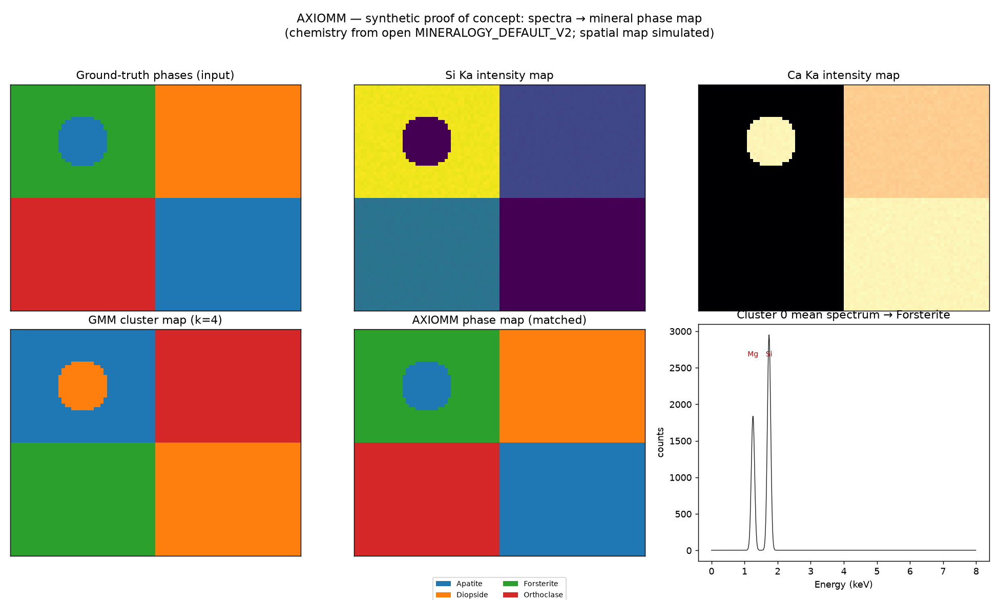

# AXIOMM analysis tools — usage

The `axiomm.analysis` package is a suite of small, independent tools for
turning a converted spectrum-image signal into decomposition, clustering,
per-line intensities, and quantitative composition. Each tool is
**usable on its own** and the tools **compose by hand** (a full pipeline
object and command-line interface are not built yet).

This page shows, for every tool available today, the exact import, a
minimal runnable example, and its real output. Every snippet below was run
as shown.

## Install

```bash
python -m pip install -e ".[analysis,quant]"
```

| Extra | Adds | Needed by |
|-------|------|-----------|
| `analysis` | `scikit-learn` | decomposition (PCA), clustering (GMM) |
| `quant` | `xraylib` | k-factors (theoretical Cliff-Lorimer) |

`numpy` is a core dependency. Optional libraries are imported lazily, so
importing a package never pulls in a library you are not using.

All result objects carry two common fields: `provenance` (an
`AnalysisProvenance` recording the tool, backend, and parameters) and
`diagnostics` (a list of `Diagnostic(severity, code, message)`).

---

## 1. Decomposition — `axiomm.analysis.decomposition`

Reduce a spectrum-image to a few components (PCA). Input is the converter's
neutral `AxiommSignalPayload`; the number of components is yours to choose
(`n_components=None` keeps all).

```python
import numpy as np
from axiomm.io.converters.models import AxisSpec, AxiommSignalPayload
from axiomm.analysis.decomposition import decompose

rng = np.random.default_rng(0)
base = rng.random((2, 8))                # two latent component spectra
coeffs = rng.random((12, 2))             # per-pixel mixing
data = (coeffs @ base).reshape(4, 3, 8)  # (x, y, energy)
axes = (
    AxisSpec("x", "navigation", 4, index_in_array=0),
    AxisSpec("y", "navigation", 3, index_in_array=1),
    AxisSpec("Energy", "signal", 8, units="keV", scale=0.01, offset=0.0, index_in_array=2),
)
payload = AxiommSignalPayload(data=data, axes=axes, signal_kind="signal1d")

result = decompose(payload, backend="pca", n_components=2)
print("factors.shape  =", result.factors.shape)
print("loadings.shape =", result.loadings.shape)
print("explained_variance_ratio =", np.round(result.explained_variance_ratio, 4))
print("nav_shape =", result.nav_shape, " n_components =", result.n_components)
print("provenance =", result.provenance)
```

```text
factors.shape  = (8, 2)
loadings.shape = (12, 2)
explained_variance_ratio = [0.9044 0.0956]
nav_shape = (4, 3)  n_components = 2
provenance = AnalysisProvenance(tool='decomposition', backend='pca', tool_version=None, params={'n_components': 2})
```

**`DecompositionResult`**: `factors` `(n_channels, n_components)` (component
spectra), `loadings` `(n_pixels, n_components)` (per-pixel scores),
`explained_variance_ratio` `(n_components,)`, `nav_shape`, `n_components`.
`loadings` is what clustering consumes next. Persist with
`write_decomposition` / `read_decomposition`.

---

## 2. Clustering — `axiomm.analysis.clustering`

Cluster the decomposition loadings (Gaussian mixture). The clusterer is
pure (features in, labels out); per-cluster **mean spectra** are a separate
step over the source signal. The number of clusters is required.

```python
from axiomm.analysis.clustering import GMMClusterer, GMMConfig, compute_cluster_means

clustering = GMMClusterer(n_clusters=2, config=GMMConfig(random_state=0)).cluster(result)
print("labels    =", clustering.labels)
print("label_map =\n", clustering.label_map)
print("cluster_ids =", clustering.cluster_ids, " masks.shape =", clustering.masks.shape)

means = compute_cluster_means(clustering, payload)
print("means.shape =", means.means.shape, " pixel_counts =", means.pixel_counts)
```

```text
labels    = [0 1 1 0 0 0 0 0 1 0 1 0]
label_map =
 [[0 1 1]
 [0 0 0]
 [0 0 1]
 [0 1 0]]
cluster_ids = [0 1]  masks.shape = (2, 4, 3)
means.shape = (2, 8)  pixel_counts = [8 4]
```

**`ClusteringResult`**: `labels` `(n_pixels,)`, `label_map` (nav-shaped),
`cluster_ids`, `n_clusters`, and a computed `masks` property
`(n_clusters, *nav_shape)`. **`ClusterMeanSpectra`**: `means`
`(n_clusters, n_channels)`, `pixel_counts`, `cluster_ids` — aligned
row-for-row to `cluster_ids`. `GMMClusterer` also accepts
`GMMConfig(covariance_type, random_state, n_init, max_iter, tol,
reg_covar)`.

---

## 3. Peak identification — `axiomm.analysis.peaks`

Measure the **background-subtracted net intensity** of element lines in one
spectrum, given a validated energy axis. Pluggable backends; the default is
flanking-window background subtraction. Reports measurement facts only.

```python
import numpy as np
from axiomm.io.converters.models import AxisSpec
from axiomm.analysis.peaks import NetIntensityMeasurer

spectrum = np.full(1000, 10.0)   # flat background = 10 counts/channel
spectrum[638:643] += 20.0        # a peak of 100 net counts near 6.40 keV
energy_axis = AxisSpec("Energy", "signal", 1000, units="keV", scale=0.01, offset=0.0)

pset = NetIntensityMeasurer().measure(spectrum, energy_axis, {"Fe": 6.40, "Si": 1.74})
print("net_by_label =", pset.net_by_label())
for m in pset.measurements:
    print("  ", m)
```

```text
net_by_label = {'Fe': 100.0, 'Si': 0.0}
   PeakMeasurement(label='Fe', center_kev=6.4, net=100.0, gross=220.0, background=10.0, n_channels=12, in_range=True)
   PeakMeasurement(label='Si', center_kev=1.74, net=0.0, gross=130.0, background=10.0, n_channels=13, in_range=True)
```

**`PeakMeasurementSet`**: `measurements` (a tuple of `PeakMeasurement`:
`label`, `center_kev`, `net`, `gross`, `background`, `n_channels`,
`in_range`) plus `net_by_label()`. Window widths are configurable via
`NetIntensityMeasurer(PeakWindowConfig(half_width_kev, bg_gap_kev,
bg_width_kev))`. A line outside the axis span is flagged `in_range=False`,
not an error. `resolve_energy_axis(axis_spec, n_channels)` validates the
axis (keV/eV only — no silent calibration) and is reused by quantification.

---

## 4. Mineralogy reference — `axiomm.analysis.mineralogy`

The named, versioned science bundle: per-element X-ray/chemical data and a
provenance-tagged mineral endmember library. Oxygen and the halogens Br/I
are excluded from structural cation vectors.

```python
import numpy as np
from axiomm.analysis.mineralogy import MINERALOGY_DEFAULT_V1 as REF

print("name =", REF.name, " version =", REF.version, " endmembers =", len(REF.minerals))
print("Fe element =", REF.elements["Fe"])
vecs = dict(REF.mineral_vectors())
order = REF.element_order()
print("Quartz cation vector (nonzero) =",
      {order[i]: round(float(v), 3) for i, v in enumerate(vecs["Quartz"]) if v})

# the preset is also registered in the shared reference registry:
from axiomm.analysis.reference import get_reference
print("via registry:", get_reference("minerals_default_v1").name)
```

```text
name = minerals_default_v1  version = 1  endmembers = 44
Fe element = ElementRef(symbol='Fe', line_energy_kev=6.404, atomic_weight=55.845, atomic_number=26, oxide_form=('FeO', 1, 1), emission_line='Ka')
Quartz cation vector (nonzero) = {'Si': 1.0}
via registry: minerals_default_v1
```

**`MineralogyReference`**: `elements` (`symbol → ElementRef`), `minerals`
(a tuple of `MineralEndmember`), `structural_exclude` (`{"O","Br","I"}`),
`family_display`, plus `element_order()` and `mineral_vectors()`
(normalized, O/Br/I-excluded cation vectors). You can build and register
your own `MineralogyReference`.

---

## 5. k-factors — `axiomm.analysis.quant`

Theoretical Cliff-Lorimer k-factors from xraylib fundamental parameters.
The excitation energy is required (no baked value); the reference element
is configurable (default `Si`).

```python
from axiomm.analysis.mineralogy import MINERALOGY_DEFAULT_V1 as REF
from axiomm.analysis.quant import compute_k_factors

cations = [REF.elements[s] for s in ["Si", "Fe", "Al", "Ca"]]
kf = compute_k_factors(cations, excitation_kev=18.0, reference="Si")
print("k_factors =", {k: round(v, 3) for k, v in kf.k_factors.items()})
print("provenance.params =", kf.provenance.params)
```

```text
k_factors = {'Si': 1.0, 'Fe': 0.027, 'Al': 1.68, 'Ca': 0.11}
method       = xraylib FP, Kissel cross-sections
line_method  = {'Si': 'CS_FluorLine_Kissel', 'Fe': 'CS_FluorLine_Kissel', ...}
xraylib_version = 4.3.0
```

**`KFactorSet`**: `k_factors` (`symbol → k_{i,ref}`), `sensitivities`,
`reference_element`, `excitation_kev`. If xraylib is not installed,
`compute_k_factors` raises `AnalysisDependencyError`. Persist with
`write_kfactors` / `read_kfactors`.

> **These k-factors are not a full quantification.** They are ratios of
> theoretical fluorescence cross-sections at the excitation energy only.
> They correct for element-dependent fluorescence yield and line
> branching — **and nothing else.** Detector efficiency and geometry,
> absorption and self-absorption, secondary fluorescence and other matrix
> effects, sample thickness, and the acquisition regime are all omitted.
> The `provenance.params` records the exact cross-section function used per
> element (`line_method`): `CS_FluorLine_Kissel` where available, with a
> recorded fall back to `CS_FluorLine` (and an `info` diagnostic) where
> xraylib has no Kissel partial cross-section — so the record never claims
> a Kissel calculation that was not actually used. See **Scientific
> assumptions & limitations** at the end of this page.

---

## 6. Cliff-Lorimer quantification — `axiomm.analysis.quant`

Turn net intensities into element and oxide weight percents, using the
k-factors. This composes tools 3–5. Iron is reported as FeO (EDS cannot
resolve its oxidation state); halogens are carried as elements. Oxygen must
be present in `elements` (for the oxide-mass conversion) but is not itself
quantified — the quantified set is exactly the k-factor elements.

```python
import numpy as np
from axiomm.io.converters.models import AxisSpec
from axiomm.analysis.peaks import NetIntensityMeasurer
from axiomm.analysis.quant import quantify

energy_axis = AxisSpec("Energy", "signal", 1000, units="keV", scale=0.01, offset=0.0)
spec = np.full(1000, 5.0)
for center, area in [(1.740, 300.0), (1.486, 200.0), (6.404, 100.0)]:  # Si, Al, Fe
    i = int(round(center / 0.01)); spec[i-2:i+3] += area / 5.0

lines = {s: REF.elements[s].line_energy_kev for s in ["Si", "Al", "Fe", "Ca"]}
peaks_q = NetIntensityMeasurer().measure(spec, energy_axis, lines)
elements_with_O = [REF.elements[s] for s in ["O", "Si", "Fe", "Al", "Ca"]]

qr = quantify(peaks_q, kf, elements_with_O)
print("net_intensities    =", {k: round(v, 1) for k, v in qr.net_intensities.items()})
print("wt_percent_element =", {k: round(v, 1) for k, v in qr.wt_percent_element.items()})
print("wt_percent_oxide   =", {k: round(v, 1) for k, v in qr.wt_percent_oxide.items()})
print("diagnostics        =", [d.code for d in qr.diagnostics])
```

```text
net_intensities    = {'Si': 300.0, 'Fe': 100.0, 'Al': 200.0, 'Ca': 0.0}
wt_percent_element = {'Si': 47.0, 'Fe': 0.4, 'Al': 52.6, 'Ca': 0.0}
wt_percent_oxide   = {'SiO2': 50.1, 'FeO': 0.3, 'Al2O3': 49.6}
diagnostics        = []
```

**`QuantResult`**: `net_intensities`, `wt_percent_element` (metals/cation
basis), `wt_percent_oxide`, `reference_element`. It also carries the raw
peak facts — `gross_intensities`, `background_per_channel`,
`window_channels` — kept so a statistically defined detection/quantification
limit can be computed later, and a `cluster_id` that ties each result to its
source cluster. `quantify_cluster_means` runs `quantify` over a sequence of
per-cluster `PeakMeasurementSet`s (from `peaks.measure_cluster_means`),
carrying each set's `cluster_id` through. Persist with `write_quant` /
`read_quant`.

`quantify` validates its inputs and refuses ambiguous data rather than
silently propagating it: k-factors must be finite and positive, net
intensities finite and non-negative, and **every** k-factor element must
have a matching `ElementRef` — an element is never silently dropped and the
remainder renormalised to 100%. Missing atomic weights or malformed oxide
stoichiometry raise `PayloadValidationError`.

> **These weight percents are an uncorrected theoretical
> sensitivity-ratio estimate, not a validated quantitative composition.**
> They apply the k-factor ratios (whose omitted physics is listed above)
> and Cliff-Lorimer closure, and nothing else. Until the estimate has been
> checked against measured standards, treat it as a screening number.
> Deciding which cluster means are clean enough to report at all is the
> separate reliability step below; a raw cluster mean is not automatically
> a validated phase composition.

---

## 7. Reliability gate — `axiomm.analysis.quant`

A GMM cluster mean averages over pixels that may mix phases or sit on
boundaries, so it is not automatically a valid spectrum. The reliability
gate is an **overlay** on a `QuantResult`: it flags elements below a
screening count floor and grades each cluster. It never rewrites the
numbers and never asserts a physical cause. All thresholds are yours to set
(`ReliabilityConfig`).

The vocabulary is deliberately conservative — nothing is called
"quantitative", because the upstream weight percents are an uncorrected
estimate (above):

- **element** `reportable` · `below_count_floor` · `invalid`
- **cluster** `reportable_estimate` · `exploratory_only` · `invalid`

A non-finite or out-of-range input (a NaN net intensity, a negative pixel
count, an impossible heterogeneity) is never graded `reportable` /
`reportable_estimate` — it is `invalid`. A cluster with no element above its
floor can never be a `reportable_estimate`. The `count_floor` is a crude
net-count screening threshold, **not** an analytical limit of detection or
quantification; you can override it per element with `element_count_floors`.

`compute_cluster_means` now also reports per-cluster `heterogeneity`
(median cosine distance of member spectra to the mean) and `total_counts`;
`assess_cluster_reliability(quant_results, cluster_means, config)` batches
the check over an enriched `ClusterMeanSpectra`. Here is the single-cluster
form:

```python
from axiomm.analysis.quant.models import QuantResult
from axiomm.analysis.quant import assess_reliability, ReliabilityConfig

# a cluster whose K is barely above background and whose mean pools mixed pixels
quant = QuantResult(
    net_intensities={"Si": 2490.0, "K": 6.0, "Ca": 120.0},
    wt_percent_element={"Si": 71.0, "K": 0.02, "Ca": 3.0},
    wt_percent_oxide={"SiO2": 74.0, "K2O": 0.02, "CaO": 3.0},
    reference_element="Si",
)
report = assess_reliability(
    quant, pixel_count=140, heterogeneity=0.32, total_counts=8.5e3,
    config=ReliabilityConfig(count_floor=50, max_heterogeneity=0.15, min_total_counts=1e4),
)
print("cluster_status =", report.cluster_status)
print("element_status =", dict(report.element_status))
print("reasons        =", list(report.reasons))
```

```text
cluster_status = exploratory_only
element_status = {'Si': 'reportable', 'K': 'below_count_floor', 'Ca': 'reportable'}
reasons        = ['heterogeneity 0.320 > 0.15', 'total_counts 8500 < 10000']
```

**`ReliabilityReport`**: `cluster_status`
(`"reportable_estimate"`/`"exploratory_only"`/`"invalid"`), `element_status`
(`sym → "reportable"`/`"below_count_floor"`/`"invalid"`), `cluster_id`, and
`reasons` (which thresholds tripped or why the inputs were invalid). Persist
with `write_reliability` / `read_reliability`.

`assess_cluster_reliability(quant_results, cluster_means, config)` batches
the check over an enriched `ClusterMeanSpectra`, **aligning each result to
its cluster by `cluster_id`** (not by position): reordered inputs are
matched correctly, and a missing or unknown `cluster_id` is an error rather
than a silent mis-alignment.

## 8. Mineral matching — `axiomm.analysis.mineralogy.match`

Rank a quantified cluster against a mineral reference and get **candidate
matches with scores and evidence** — never a validated identification. S3d
converts the cluster's cation **mass** fractions and every reference
endmember to one common **molar/element** basis before scoring (so mass
fractions are never compared to stoichiometric cation counts), keeps the
measured structural elements F/S/Cl while excluding O/Br/I, treats
below-floor and unmeasured elements as *censored/uncertain* rather than zero,
and refuses to present a sparse overlap as a confident match.

Use the **basis-audited** `MINERALOGY_DEFAULT_V2`; the legacy
`MINERALOGY_DEFAULT_V1` is basis-unaudited and the matcher rejects it. A
`ReliabilityReport` is required by default (pass `allow_ungated=True` to match
without one — it is recorded prominently).

The end-to-end output AXIOMM is built for — a **mineral phase map** — is shown
by [`examples/phase_map_demo.py`](../../examples/phase_map_demo.py), which runs
the whole pipeline (decomposition → clustering → cluster means → peaks →
k-factors → quantification → reliability → matching) on a synthetic map built
from this open reference chemistry and renders the phase map beside each step:



```python
from axiomm.analysis.mineralogy import MINERALOGY_DEFAULT_V2 as REF
from axiomm.analysis.mineralogy.match import match_cluster, MatchConfig
from axiomm.analysis.quant.models import QuantResult
from axiomm.analysis.quant.reliability import ReliabilityReport

# an olivine-like cluster: Mg,Si cation mass fractions from S3c
qr = QuantResult(
    net_intensities={"Mg": 1.0, "Si": 1.0},
    wt_percent_element={"Mg": 34.5, "Si": 19.9},
    wt_percent_oxide={}, reference_element="Si", cluster_id=1,
)
report = ReliabilityReport(
    cluster_status="reportable_estimate",
    element_status={"Mg": "reportable", "Si": "reportable"},
    reasons=(), cluster_id=1,
)
result = match_cluster(qr, REF, reliability=report, config=MatchConfig(top_k=3))
print("input_reliability =", result.input_reliability, "| gated:", result.reliability_gated)
for c in result.candidates:
    print(f"  {c.name:20s} score={c.score:.3f} used={list(c.elements_used)} "
          f"dim_cov={c.dimension_coverage:.2f} comp_cov={c.composition_coverage:.2f}")
print("best =", result.best().name if result.best() else None)
```

```text
input_reliability = reportable_estimate | gated: True
  Forsterite           score=1.000 used=['Mg', 'Si'] dim_cov=1.00 comp_cov=1.00
  Apatite (measured)   score=0.995 used=['Mg', 'Si'] dim_cov=0.40 comp_cov=0.01
  Phlogopite           score=0.948 used=['Mg', 'Si'] dim_cov=0.40 comp_cov=0.67
best = Forsterite
```

Forsterite wins outright, and the coverage fields expose the runner-ups as
spurious partial overlaps — `Apatite (measured)` scores 0.995 on the shared
Mg/Si but represents only `comp_cov=0.01` of apatite's composition, so it is
plainly not the phase.

**`MineralMatchResult`**: `candidates` (rank-eligible, best-first; **may be
empty**), `insufficient` (flagged for too-sparse overlap), `cluster_id`,
`input_reliability`, `reliability_gated`, `library_name`/`library_version`,
provenance and diagnostics. `best()` returns the top candidate **or `None`** —
there is no unconditional single label. Each `MineralCandidate` carries
`score` (a `[0,1]` rank score), `elements_used`, `elements_censored`,
`elements_unavailable`, `n_informative_dims`, and both `dimension_coverage`
and `composition_coverage` so a well-covered match is distinguishable from a
lucky partial one (note Phlogopite's 0.43 dimension coverage above).
`match_clusters` batches over clusters, aligning reliabilities one-to-one by
`cluster_id`. Persist with `write_match` / `read_match`.

> **These are candidate rankings of an uncalibrated screening estimate, not
> mineral identifications.** The count floor is not an LOD/LOQ; `exploratory_only`
> clusters are ranked only on explicit opt-in and keep their warning. See the
> section below — **standards validation remains mandatory** before any
> quantitative-accuracy or validated mineral-identification claim.

---

## Composing the tools

The examples above already chain: a payload flows through
`decompose` → `cluster` → `compute_cluster_means`, and a spectrum flows
through `measure` → `quantify` with `compute_k_factors`. Because every tool
reads and writes plain typed objects (and offers file adapters), you wire
them together in whatever order your analysis needs — each one remains
runnable and testable on its own.

---

## Scientific assumptions & limitations

The quantification tools are **software-correct** — validated inputs,
honest provenance, no silent data loss — but they are **not empirically
calibrated**. Read this before treating any weight percent as a
composition.

### What the numbers are

The k-factors are ratios of theoretical fluorescence cross-sections
(xraylib fundamental parameters) at the excitation energy. The weight
percents apply those ratios plus Cliff-Lorimer closure. That is the whole
physical model. It is best described as an **uncorrected theoretical
sensitivity-ratio estimate**.

### What is deliberately omitted (needs empirical calibration)

The k-factor model corrects for fluorescence yield and line branching, and
nothing else. All of the following are **not** modelled, and each can move
a reported percent by a large factor:

- detector efficiency and solid-angle geometry;
- X-ray absorption and self-absorption in the sample;
- secondary (and higher-order) fluorescence and other matrix effects;
- sample thickness / the thin-vs-thick-specimen regime;
- the acquisition regime (live time, dead time, pile-up).

**Until the output has been validated against measured standards of known
composition, it is a screening estimate, not a measurement.** Iron is
reported as FeO because EDS/XRM cannot resolve oxidation state; halogens are
carried as elements; oxygen is added by assumed oxide stoichiometry, not
measured.

### Detection / quantification limits are not implemented

`ReliabilityConfig.count_floor` (default 50 net counts) is a crude
screening threshold, **not** an analytically defined limit of detection
(LOD) or quantification (LOQ). A real LOD/LOQ is a statistical statement
about counts, background and window width. Those raw inputs are retained on
every `QuantResult` (`gross_intensities`, `background_per_channel`,
`window_channels`) so a principled per-element LOD/LOQ can be added later;
it is **deferred** and requires a design decision.

### The heterogeneity metric is provisional

`compute_cluster_means` reports per-cluster `heterogeneity` as the *median*
cosine distance of member spectra to the cluster mean. Two known
limitations are **not** yet addressed and require count-controlled
validation before any redesign:

- the median is insensitive to a **minority** (< 50 %) mixed population — a
  cluster that is mostly one phase with a substantial contaminant fraction
  can still read as homogeneous;
- cosine distance **confounds** genuine compositional mixing with Poisson
  counting noise, so low-count clusters look more heterogeneous than they
  are.

What *is* fixed: a zero-norm (blank) member is excluded rather than scored
as identical to the mean, and a degenerate all-zero cluster mean yields an
undefined (`NaN`) heterogeneity rather than a false zero. Choosing a
noise-aware or upper-quantile / fraction-exceeding metric is deferred.

### Provenance you can audit

Every payload carries an `AnalysisProvenance`. For quantification it records
the k-factor values and reference element, the per-element cross-section
method (`line_method`), the xraylib version and backend, the excitation
energy, the oxide convention used, and the physical-model caveat string; the
reliability report records the thresholds applied and the exact inputs it
assessed. Serialization is strict: files carry a `schema_version` and a
payload `kind`, both checked on read, and non-finite values (NaN /
Infinity) are rejected in both directions.

### Mineral matching is exploratory ranking

S3d (§8) produces **candidate rankings, never identifications.** It scores an
uncalibrated screening estimate: the same omitted physics and missing LOD/LOQ
above apply, so a top-ranked candidate is a screening result, not a confirmed
phase. The reference compositions are basis-audited (`MINERALOGY_DEFAULT_V2`):
the idealised endmembers are stoichiometric atom counts, and the measured /
GeoReM-standard endmembers originate as oxide wt% (Fe as FeO; F/Cl as element
wt%) converted to cation proportions — every cluster and reference is brought
to one molar/element basis before scoring, with the conversion recorded in
provenance. Evidence support (`dimension_coverage`, `composition_coverage`,
`n_informative_dims`) guards against a sparse overlap scoring as a perfect
match, and below-floor / unmeasured elements are censored, not zeroed.
**Standards validation remains mandatory** before any quantitative-accuracy or
validated mineral-identification claim.
